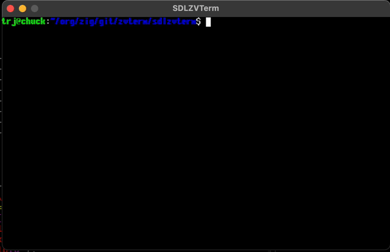

# ZVTerm

A Zig wrapper for [libvterm](https://www.leonerd.org.uk/code/libvterm/), exposing a small subset in a native Zig API.

(Just enough to build a working toy terminal emulator)



See `examples/helloworld.zig` for usage.

See `sdlzvterm/` for a janky terminal implementation in SDL.

```zig
    // setup an 80x24 terminal
    var term = try ZVTerm.init(allocator, 80, 24);
    defer term.deinit();
    // get a writer to send data to the terminal
    var writer = term.getWriter();
    // write terminal escape codes
    try writer.print("\x1b[10;10HHello world", .{});

    // read back the screen state for each x,y position
    for (0..term.height) |y| {
        for (0..term.width) |x| {
            const cell = term.getCell(x, y);
            // paint cell.char:u8 using cell.fgRGBA:u32 and cell.bgRGBA:u32 colours
            ...
        }
    }
```

To build and run the simple demo,

    zig build helloworld

To build and run the SDL demo terminal,

    cd sdlzvterm
    zig build run


# Use

First we add the library as a dependency in our `build.zig.zon` file.

`zig fetch --save git+https://github.com/ringtailsoftware/zvterm.git`

And add it to `build.zig` file.
```zig
const zvterm_dep = b.dependency("zvterm", .{
    .target = target,
    .optimize = optimize,
});

exe.root_module.addImport("zvterm", zvterm_dep.module("zvterm"));
```

# Status

There's plenty to add in order to make a real terminal emulator. libvterm is capable, but the zig API needs extending to do more

 - unicode
 - cursor location
 - bell
 - handle callbacks for dirty areas, to avoid constantly redrawing entire screen


